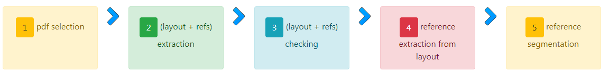

# SSOAR Gold Standard
This repository contains manually inspected datasets for evaluating the different steps during the reference extraction process. 
All datasets consist of research papers which come from the **[SSOAR repository](http://www.ssoar.info/)**. 
This corpus will grow constantly.

## big picture of "gold standard process"

## Content
* Number of all papers in repository: 351
* Number of German papers in repository: 251
* Number of English papers in repository: 100

### How access to papers:
* Papers are divided into two groups (according to their language) and there are six different folders in each groups.
1. [German_papers](1-German_papers)
   - There are 225 papers in this folder.
   - [219 paper with reference section at the end of document](1-German_papers/1-German_papers(with_reference_section_at_end_of_paper))
   - [12 paper with references in footnote and at the end of document](1-German_papers/2-German_papers(with_reference_in_footnote))
   - [20 paper with references in footnote](1-German_papers/3-German_papers(with_reference_in_footnote_and_end_of_paper))
2. [English_papers](2-English_papers)
   - There are 100 papers in this folder.
3. [Guidelinefiles](3-Guidelinefiles/)
   - Guideline files are located in this folder.

    
**Each folder contains several sub-folders:**
1. **Pdfs**
    * This folder contains pdf files which are randomly picked from [SSOAR publications](http://www.ssoar.info/)(for understanding how they are selected see **Selection method**).
2. **Layouts**
    * This folder contains extracted layout files from selected pdfs.
    * [CERMINE](https://github.com/CeON/CERMINE) is used for Generating layout CSV files from given PDFs.
3. **Layout with identified references**
    * This folder contains layout files plus identified references and all the reference strings are annotated and checked manually.
    * [EXRef-Identifier](https://github.com/exciteproject/EXannotator) is used for checking identified reference strings in layout files.
4. **Extracted References from Layouts**
    * This folder contains extracted reference strings from annotated layout files (the output of step 3).
    * [refext ](https://github.com/exciteproject/refext) is used for extracting reference strings from layout files.
5. **Segmented References**
    * This folder contains segmented reference strings.
    * references are checked and edited manually by [EXRefmeta-Extractor Tool](https://github.com/exciteproject/EXannotator)
6. Merged Layout and segmented references
    * This folder contains layout files(from step 3) which are merged with segmented reference strings(from step 5).

### Selection method
We randomly select our papers from the 33,954 available publications in [SSOAR repository](http://www.ssoar.info/).
### Files name
Files name are equal to SSOAR ID (For easier referencing).
> For example, ``12826.pdf`` refers to SSOAR ID 12826.
### How access to papers in SSOAR repository
By searching SSOARID (file name) in [SSOAR repository](http://www.ssoar.info/), you can access each paper(metadata and pdf).

### Selection criteria
* selected papers are in German or English languages. (other languages are excluded)
* selected papers are not in OCR or scanned (images) format or do not have a watermark in the background.
* selected papers contain a reference section at end of the paper or some short citation as a footnote .
* Number of References are in the range of: (3 < Reference < 50) 

## How to generate GoldStandard for EXparser All Steps:
1. Selecting Pdfs according to mentioned selection method and criteria.
2. Extracting Layout from Pdfs:
    * The used project to extracting layout from pdf is [Refex](https://github.com/exciteproject/refext)
    * To underestand that what is layout exactly click [here](https://github.com/exciteproject/EXgoldstandard/tree/master/Goldstandard_EXparser/1-German_papers/1-German_papers(with_reference_section_at_end_of_paper)/2-layouts)
3. Using EXRef-Identifier as a Reference String Identifier:
    * EXRef-Identifier is a small Java-script code which is available [here](https://github.com/exciteproject/EXannotator/tree/master/EXRef-Identifier)
    * A live demo is available [here](http://excite.west.uni-koblenz.de/refanno/index.html)
    * A video tutorial to learn how to use this tool is available [here](https://www.youtube.com/watch?v=QSiqIHts23I&t=21s)
4. Again using [Refex](https://github.com/exciteproject/refext) to extract annotated references from the generated layouts in previous step.
5. Using EXRef-Segmentation as a Meta Data Segmentation:
    * EXRef-Segmentation is a small Java-script code which is available [here](https://github.com/exciteproject/EXannotator/tree/master/EXRef-Segmentation)
    * A live demo is available [here](http://excite.west.uni-koblenz.de/seganno/index.html)
    * A video tutorial to learn how to use this tool is available [here](https://www.youtube.com/watch?v=xwed_XugR7E)
6. Using a small python code to integrate the annotated meta (step 5) data in layout (step 3) file.
    * This code is available [here]()
7. Using these generated Gold standard to train a model for [Exparser](https://github.com/exciteproject/Exparser)
    * To underestand how to train the EXparser please click [here](https://exparser.readthedocs.io/en/latest/)
